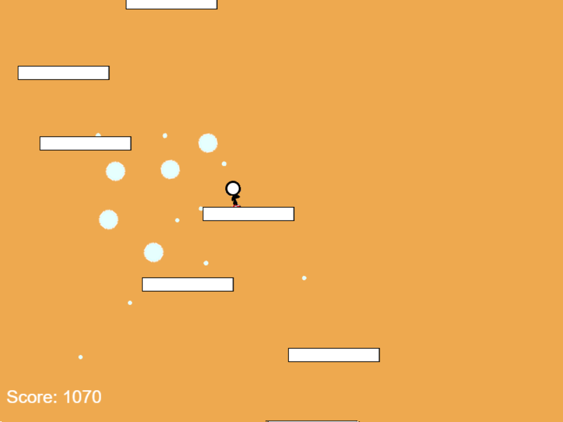

# Crazy Fall
#### National Tsing Hua University
#### CS 241002 Software Studio 2018 Spring Assignment 2
A 2D jumping web game using Phaser game framework

</img>

## Game Detail Description
Go down the stairs as many as you can. The stair have four types, landing on normal / bouncing / fake / fast stair gets you 10 / 10 / 50 / 100 points.

## Control
 - Left Arrow: Go left
 - Right Arrow: Go Right

## Features
* The game are consist of five states: Start Menu => Game View => Game Over => Quit or Play again
* There are three types of stair: Normal, Fast, Fake, Bouncing
* Sprite movement will be affected by stairs according to the landing stair type
* Particles will be produced according to the sprite status and landing stair type
* Player can upload their score to the rank. The rank only show top six highest score

## Credits
 - Backgorund music 1 (bg_music1.mp3): 
 "Flying Kerfuffle" by Kevin MacLeod (https://incompetech.com)
 Licence: CC BY (http://creativecommons.org/licenses/by/4.0/)
 - Background music 2 (bg_music2.mp3):
 "Pookatori and Friends" by Kevin MacLeod (https://incompetech.com)
 Licence: CC BY (http://creativecommons.org/licenses/by/4.0/)
 - Landing sound (land.wav)
 "hop2" by felixyadomi (https://freesound.org/)
 Licence: CC BY (http://creativecommons.org/licenses/by/3.0/)
 - Game begin sound (begin.wav)
 "begin" by tim.kahn (https://freesound.org/)
 Licence: CC BY (http://creativecommons.org/licenses/by/3.0/)

## Student ID , Name and Template URL
-  Name: Hao-Ping Lin
-  URL: https://1052005s.gitlab.io/Assignment_02
